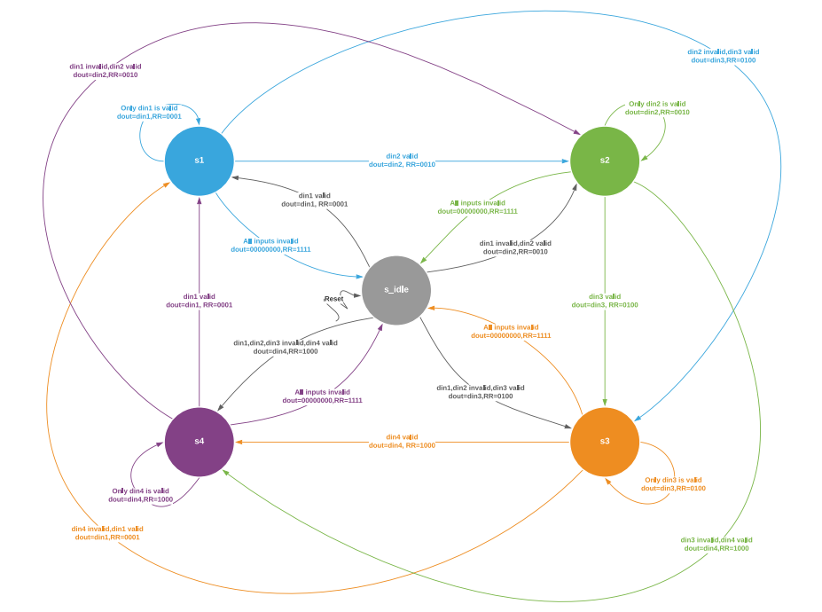
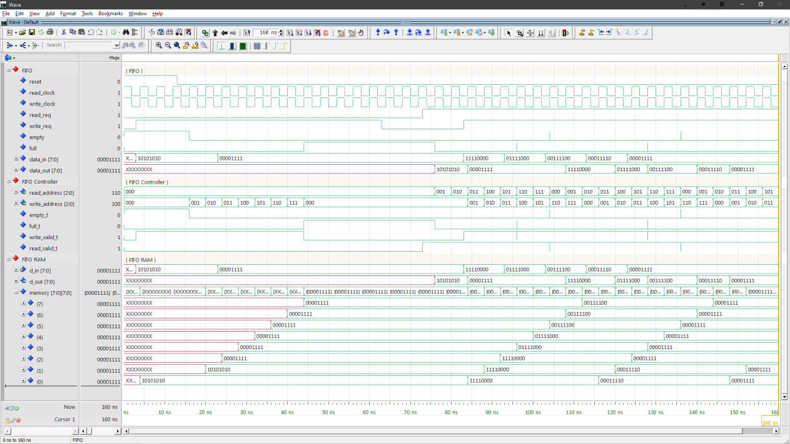

# Networks-on-Chip (NoC) Router

Networks-on-Chip (NoC) Router in VHDL, testing
and simulating on ModelSim PE Student Edition and Xilinx Vivado/ISE Design Suite.

## Block diagram

## Scheduler FSM

## Scheduler block diagrma

## FIFO Simulation

